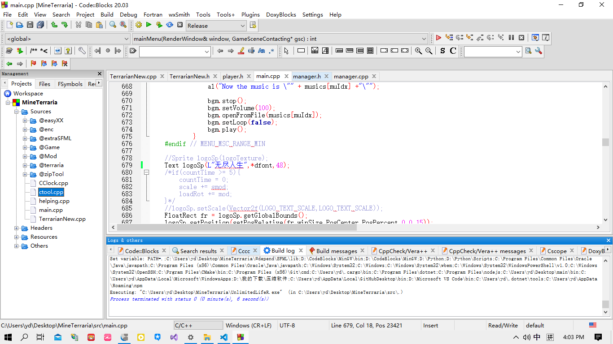
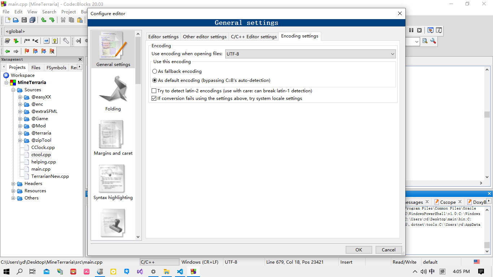

#### undefined reference to `game::ChunkHelper::QuickFindDes(game::HChunkDesc&, std::vector<game::CDataDes, std::allocator[game::CDataDes](game::CDataDes) >&)`

    很简单，我没实现QuickFindRes

#### MINGW竟然支持L WideChar!!!!

    

之前不支持是因为字符编码问题，到codeblocks->Settings->Editor->GeneralSettings->EncodingSettings下改成图中样式即可

